[中文](README.md) | [English](README.en.md)

# PanelBlind · 知华产品盲评与评分闭环系统


**知华科技（上海如静知华信息科技有限公司）** · <https://www.zhuatech.cn/> · 商业授权、定制开发、部署与系统集成咨询微信 **zhuatech / zhuatech2**。

**公开源码学习版／非商业源码版**。自有源码适用 [ZhuaTech Non-Commercial Source License 1.0](LICENSE)，未经书面授权不得商用。第三方组件保留各自版权及许可。本项目属于公开可读源码，不是 OSI 认可的开源许可。

面向企业内部包装外观、产品设计和材料触感对比：方案设计、独立审签、样品身份保管、盲码呈现、本人评分、完整性复核、评分封存和双人解盲。用于学习如何把身份隔离、真实数据持久化和明确岗位约束落实到业务接口与页面。

[操作手册](docs/操作手册.md) · [接口说明](docs/接口说明.md) · [架构与数据](docs/架构与数据.md) · [安全说明](SECURITY.md)

## 从方案到冻结结果

```text
草稿／退回 → 提交 → 独立批准并生成盲码 → 开始评分
                    ↓
             本人收悉 → 逐样评分／明确缺测 → 提交锁定
                    ↓
             独立完整性复核：接受／退回／排除
                    ↓
       正常结束／中止 → 独立封存 → 保管员申请解盲
                    ↓
             指定独立审签员批准解盲 → 结果冻结
```

产品主观评价是一类独立业务主题，[ISO 11136 的公开摘要](https://www.iso.org/standard/50125.html)介绍了受控环境中的产品喜好反馈。本软件自主定义工作流程和呈现算法，不复制标准正文，不宣称符合该标准、认证或有效消费者研究。

## 已实现功能

| 业务 | 实际行为 |
|---|---|
| 方案管理 | 唯一编号、负责部门、类型、操作说明、指定审签／保管岗位；草稿及退回状态可修改，编号及部门不可改 |
| 样品与量表 | 2—8个内部样品；1—8个整数评分量表，范围在0—10内，明确上下端含义，至少一个必录量表 |
| 内部名单 | 4—32个不同账号，人数为样品数整数倍；编辑过方案的人、保管员和审签员不能参与评分 |
| 一次布局 | 审批事务中生成3位随机盲码和循环置换呈现序；完整名单中每个样品在每个位置次数相同 |
| 身份隔离 | 普通详情不包含真实样品名称或内部样品ID；身份映射由单独接口检查岗位并记录读取审计 |
| 评分员工作台 | 只显示本人评分单、盲码、呈现序及量表；需先收悉说明；填整数值或明确缺测，不把缺测变成零 |
| 密封与复核 | 未提交评分只由本人读取；提交后锁定，指定审签员可接受完整性、退回或排除，不替换主观分数 |
| 封存与解盲 | 正常完成需至少两张已接受评分单，所有单据终结；中止单独保留结局；双人解盲后不可重开 |
| 描述统计 | 解盲后按样品和量表显示有效N、缺测数、均值、最小值和最大值；退出／排除记录保留但不计入 |
| 查询与导出 | 授权搜索、状态筛选、排序、分页、JSON和CSV；导出保持页面密封及本人范围，防CSV公式注入 |
| 账号与管理 | BCrypt口令、会话登录／退出／改密、角色、部门、菜单、权限目录、产品字典、真实参数、审计 |
| 页面 | 中文／英文、电脑／手机布局、空状态、错误反馈、真实统计和知华咨询入口 |

## 岗位与数据范围

| 岗位 | 默认权限与约束 |
|---|---|
| 管理员 | 管理身份与授权，读取范围内方案；仍需符合业务指定岗位和独立性，不自动取得所有评分或映射 |
| 方案设计 | 本部门设计、样品／量表／名单维护、推进与导出；本人曾编辑的方案不能由本人独立审签 |
| 独立审签 | 指定方案批准、提交评分完整性复核、封存与解盲审批；解盲前无法读取样品身份映射 |
| 样品保管 | 指定方案的真实样品与盲码对应关系、申请解盲；不具备评分审签权 |
| 内部评分 | 本人获分配的方案和评分单；不能读取他人评分单、全员目录或样品身份映射 |

接口每次读取实时账号、角色和数据范围。名单中的评分员身份优先于ALL范围、管理员及混合权限；参与评分的账号始终只读取本人评分单。解盲后，授权方案成员可查看冻结的汇总结果，仍不能取得其他评分员的明细。部门之外的审签员／保管员仅通过明确指定获得相应方案访问。

审批、评分与解盲均由后端检查，隐藏菜单不代替权限校验。口令散列不出现在账号响应；禁用、改密及角色撤权会使相应会话或操作即时失效。

## 呈现、评分与统计口径

- 算法标记为`CYCLIC-SHUFFLE-1`：服务器使用`SecureRandom`置换样品和评价员，再循环移位形成位置均衡设计，分配独立随机三位码。盲码在同一方案中不重复，方案之间可复用。随机源不发布；冻结的数据库行及摘要构成布局记录。
- 位置均衡只针对完整初始名单。不保证一阶残留／前样影响平衡，也不保证退出后仍均衡。软件不自动决定人数、研究功效、产品适宜性或消费者代表性。
- 评分是量表范围内整数；数值与缺测原因互斥。每个呈现样品的所有必录量表须有明确响应，选录量表可以不填。
- 评分单提交后不允许本人编辑。退回后可修订并重新提交，操作轨迹保存修订事实。接受和退出／排除均为终态，不删除已填写数据。
- 审签员检查完整性与协议执行，不把不喜欢的分数改成喜欢，也不代填评价。
- 正常结束要求全部评分单已接受或退出，至少两张已接受；中止允许零张已接受，但必须先处理待复核评分。中止结局不会伪装为正常完成。
- 均值只计算已接受评分单中的非缺测值，四位小数显示。缺测不进分母；全缺测的均值／范围为null。无ANOVA、显著性检验、排名推荐或自动产品选择。
- 封存后由指定保管员申请解盲，指定独立审签员批准。封存摘要和结果摘要持久化，解盲后方案、名单、评分和映射全部冻结。
- 名称、量表说明、人工备注及实物标签由组织者保证不泄露样品身份。软件接口隔离不能消除实物识别、人员事先知情或数据库管理员访问。

## 当前运行页面

页面截图来自运行系统，业务记录均为隔离验收中的`TEST`记录；源码默认空业务库。

| 登录与评分员 | 方案与盲码 |
|---|---|
| 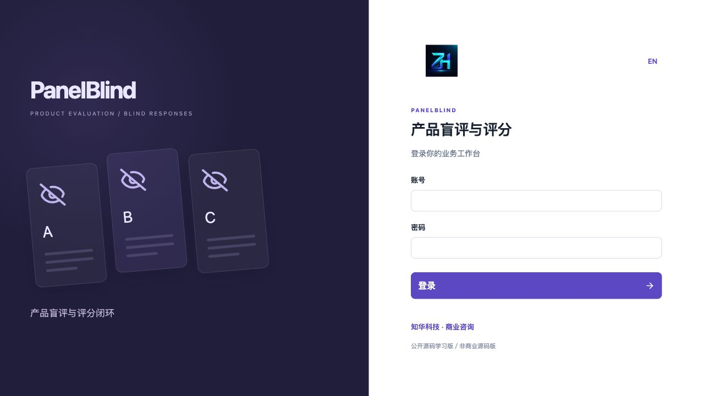<br>**登录**：通过会话认证进入工作空间。 | 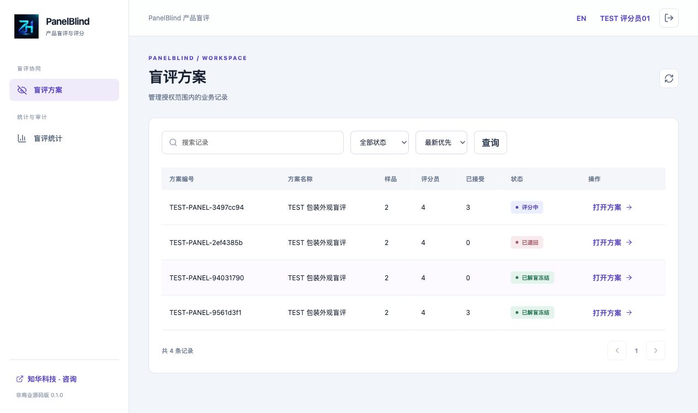<br>**评分员工作台**：查看本人被分配的方案和评分单。 |
| 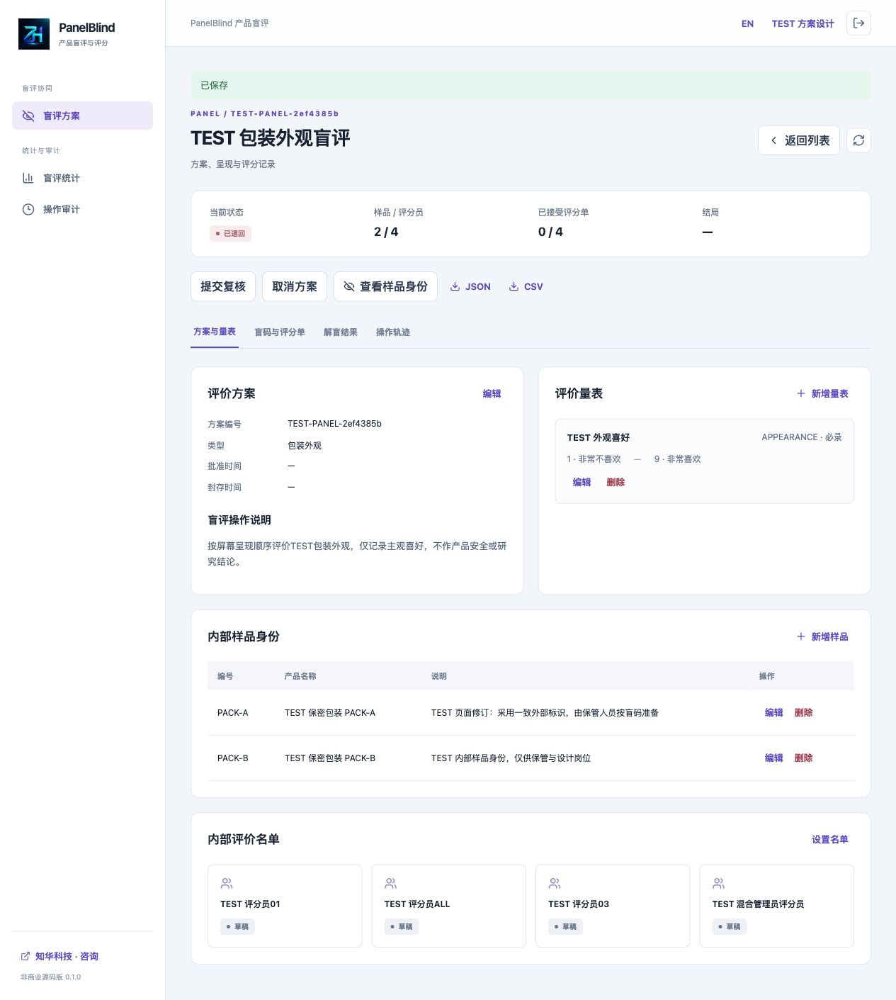<br>**方案与量表**：维护未冻结的定义、范围和评分锚点。 | 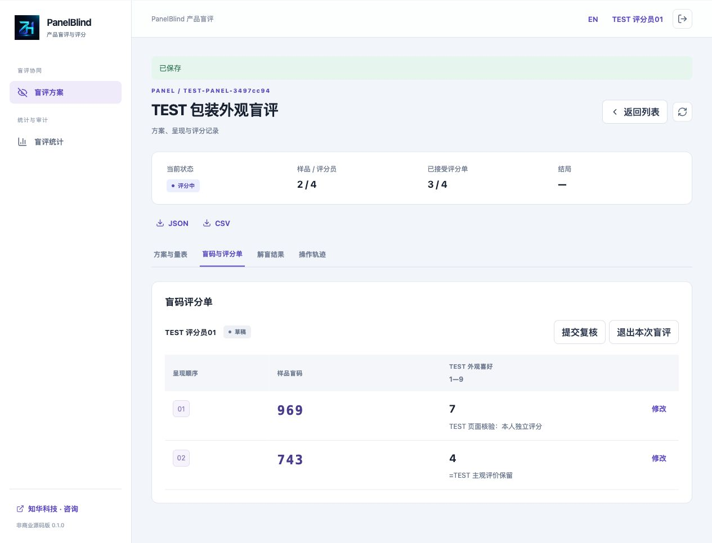<br>**盲码评分**：按呈现序填写整数分数或明确缺测。 |
| 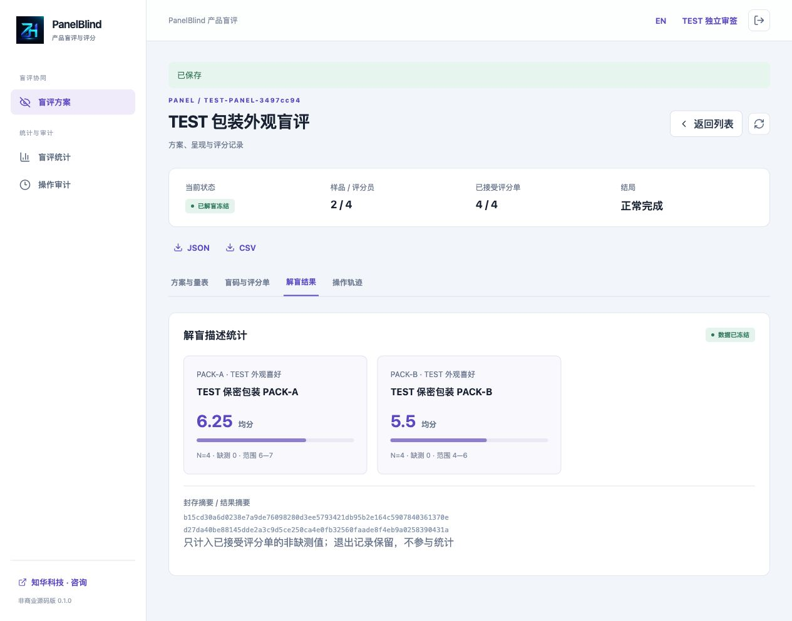<br>**解盲结果**：查看冻结后的有效数量、均值及范围。 | 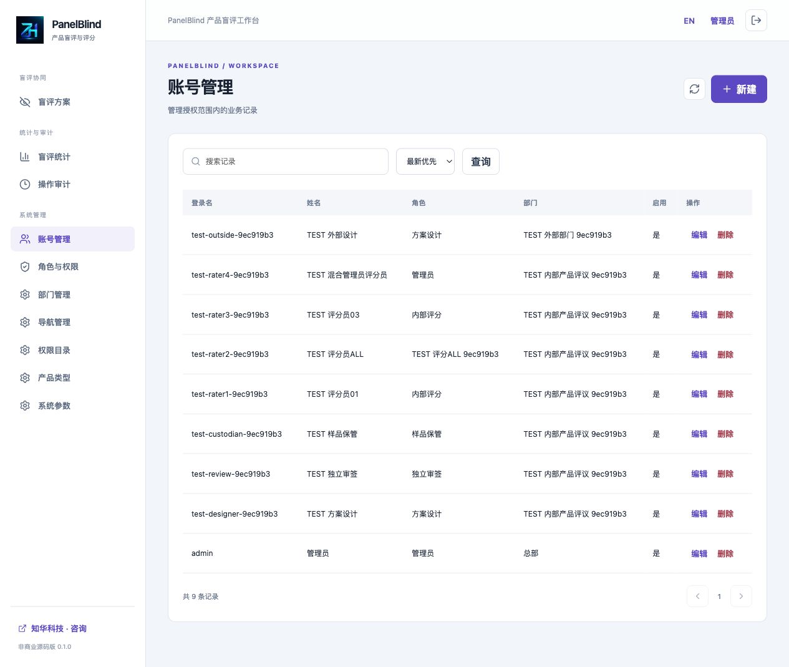<br>**账号管理**：维护账号、部门及启用状态。 |
| 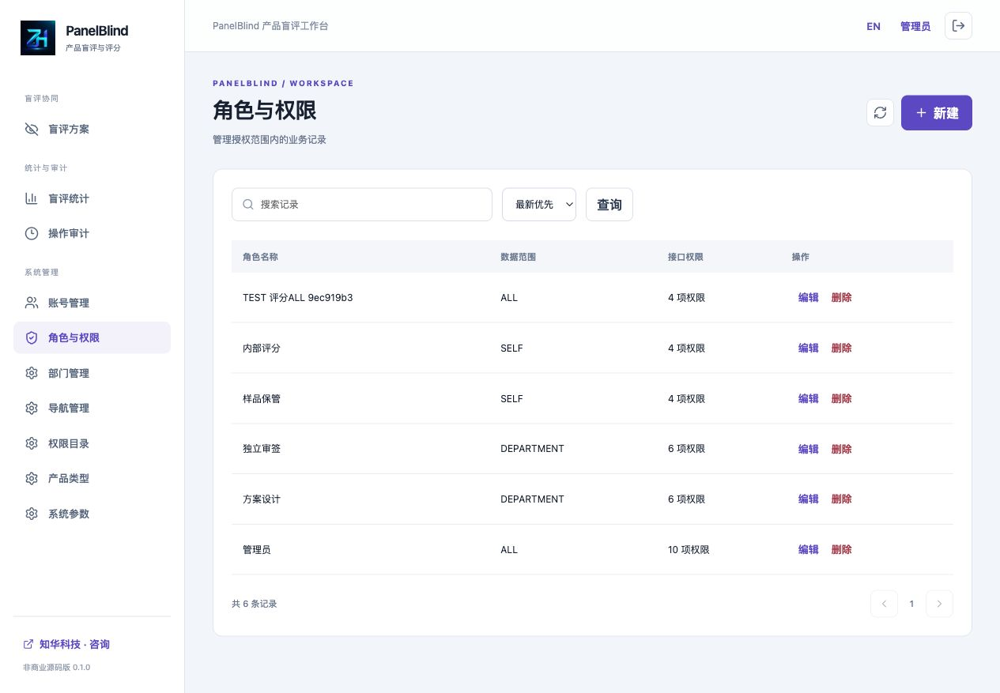<br>**角色权限**：配置接口权限与数据范围。 | 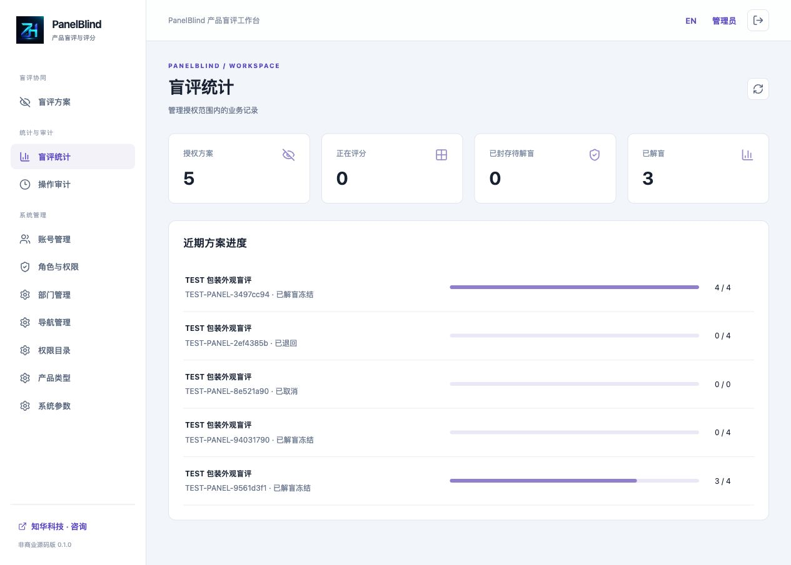<br>**统计**：查看授权范围内的实际流程进度。 |
| 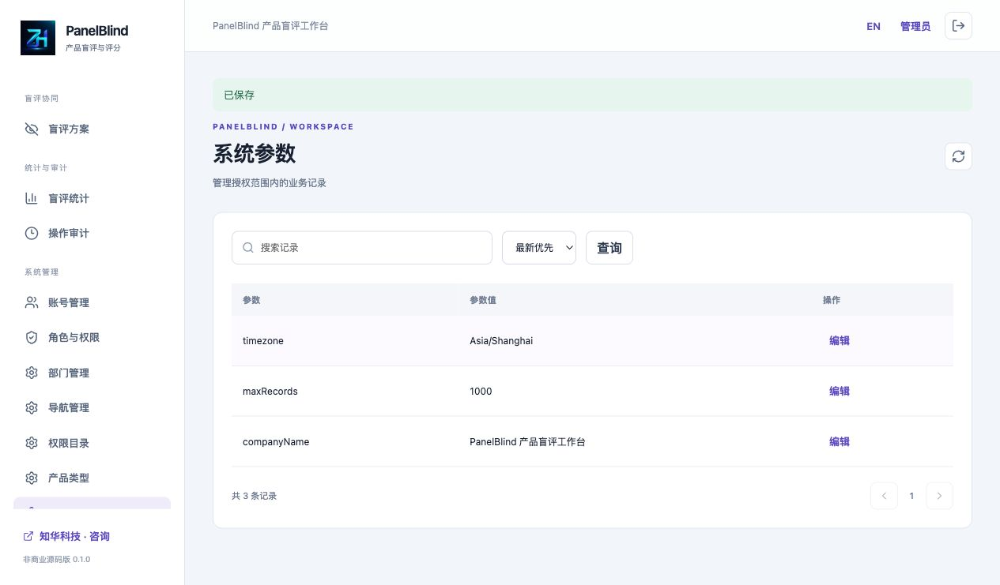<br>**系统参数**：维护支持调整的工作空间设置。 | 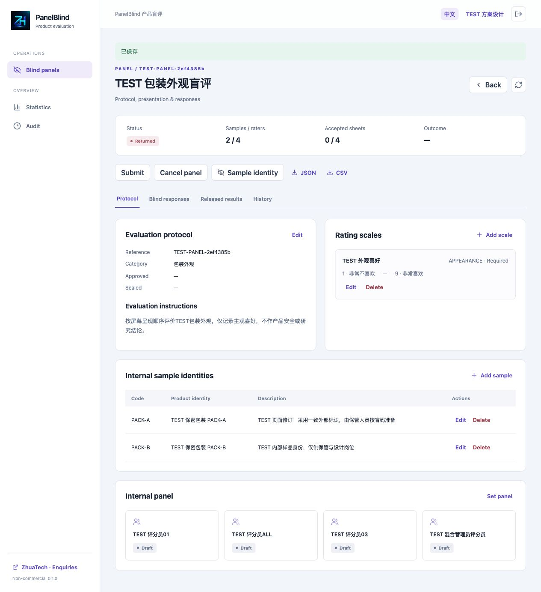<br>**英文界面**：查看英文操作页面。 |
| 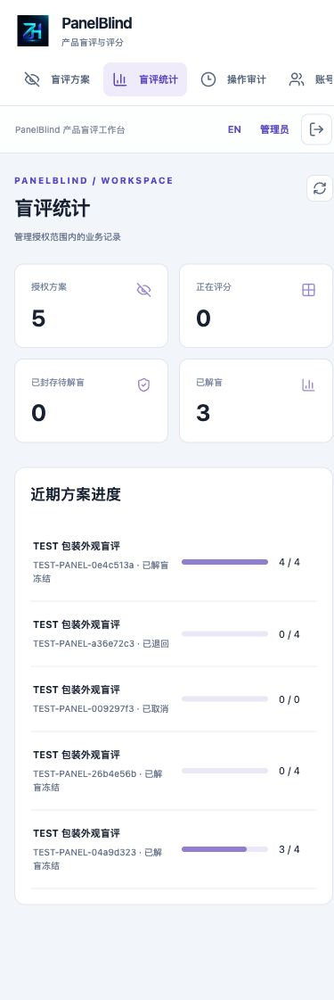<br>**手机界面**：在窄屏布局中查看和操作评分流程。 | |

## 技术与工程

| 部分 | 版本／方式 |
|---|---|
| 后端 | Java21、Maven3.9、Spring Boot4.0.7、Spring Security、JPA、Flyway、MariaDB JDBC3.5.10 |
| 前端 | Node24.19.0、npm11、Vue3.5.40、Vite8.1.5、Lucide1.48.0、Prettier、ESLint |
| 数据库 | MySQL8.4，包含于MySQL8系列；版本化SQL迁移、外键与唯一约束，JPA只校验结构 |
| 部署 | Docker Compose：MySQL、Java服务和Nginx前端；数据库与后端不公开宿主端口 |
| 时间 | 软件事实UTC微秒，页面固定Asia/Shanghai；系统参数不改变数据库事实 |
| 验收 | JUnit HTTP/JPA与算法单元测试、Node测试、独立MySQL完整业务与恢复脚本 |

```text
backend/src/main/java/cn/zhuatech/panelblind/   身份、业务、算法与接口
backend/src/main/resources/db/migration/     V1身份／V2盲评
backend/src/test/                            实际HTTP/JPA及算法测试
frontend/src/                               页面、有限表单、API与测试
frontend/public/brand/                      原始LOGO和两张微信二维码
docs/                                      操作、接口、架构与真实截图
scripts/                                   随机本机配置、隔离验收、公开检查
compose.yaml                               完整本机部署
```

## 首次运行：Docker Compose

准备Docker及Compose、Python3.11+。联网构建需要官方镜像、Maven Central和npm；无需配置AI、仪器或外部业务账户。

```bash
python3 scripts/init-env.py
docker compose config --quiet
docker compose up --build -d --wait
```

访问 **[http://127.0.0.1:8131/](http://127.0.0.1:8131/)**，初始化账号为`admin`，密码读取本机被忽略的`.env`中的`ADMIN_PASSWORD`。密码随机生成并以0600保存，不提供公开固定口令。脚本拒绝覆盖已有文件。仅变更环境变量不会重置已有数据库账号。

默认初始化总部、五种角色、十个权限、十个菜单、四种产品字典和三个参数，不初始化方案、样品或评分。建立独立审签员、保管员及内部评分账号后即可通过页面建立方案。评分与样品身份资料不应使用真实客户数据进行公开演示。

| 环境变量 | 用途 |
|---|---|
| `DATABASE_PASSWORD` | Compose数据库应用账户密码，必填 |
| `MYSQL_ROOT_PASSWORD` | 本机数据库管理口令，必填 |
| `ADMIN_PASSWORD` | 仅空库首次初始化管理员，必填 |
| `WEB_PORT` | 前端端口，默认8131 |
| `BIND_ADDRESS` | 默认127.0.0.1，回环访问 |
| `COOKIE_SECURE` | 本机HTTP false；可信HTTPS对外部署true |
| `DATABASE_URL` / `DATABASE_USER` / `DATABASE_CATALOG` | 后端源码开发可选；Compose预置内部MySQL连接 |

健康检查：[http://127.0.0.1:8131/actuator/health](http://127.0.0.1:8131/actuator/health)。正常响应为`{"status":"UP"}`，不公开数据库、口令或业务计数。完整构建会执行后端测试，不跳过测试。

停止服务用`docker compose down`，保留数据库卷。只有明确要删除本机测试数据时使用`docker compose down -v`；不得用于生产或他人数据库。

## 源码开发

```bash
# 后端：Java21、Maven3.9、已迁移的本机MySQL
# 为进程设置DATABASE_URL、DATABASE_USER、DATABASE_CATALOG、DATABASE_PASSWORD和ADMIN_PASSWORD
cd backend
mvn spring-boot:run
```

前端使用另一个终端，在项目根目录执行；需要Node24.19.0 / npm11：

```bash
cd frontend
npm ci
npm run dev
```

Vite默认回环开发端口，`/api`与`/actuator`代理到127.0.0.1:8080。前后端同源部署；API业务及管理入口均鉴权。运行版本和配置名以配置文件、锁文件及文档为准。

## 数据库、迁移与备份

迁移文件：`V1__identity.sql`、`V2__blind_panels.sql`；共18张业务与身份表，另含Flyway历史表。外键保留被引用的账号和部门；数据库唯一约束保护方案编号、样品／量表编号、名单、呈现位置和评分格。

软件启动时由Flyway执行版本迁移，已有迁移不得修改，升级新增版本。初始化只在账号表为空时执行；重启不会清空或重建业务。升级前保留数据库备份，在独立环境验证迁移与恢复。

```bash
umask 077
mkdir -p private-backups
chmod 700 private-backups
docker compose exec -T mysql sh -c 'exec mysqldump -uroot -p"$MYSQL_ROOT_PASSWORD" --single-transaction --no-tablespaces --set-gtid-purged=OFF "$MYSQL_DATABASE"' > private-backups/panelblind.sql
chmod 600 private-backups/panelblind.sql
# 在独立空数据库恢复，确认目标后执行；不要覆盖原业务库
# docker compose -p panelblind-restore exec -T mysql sh -c 'exec mysql -uroot -p"$MYSQL_ROOT_PASSWORD" "$MYSQL_DATABASE"' < private-backups/panelblind.sql
```

备份含样品身份、员工账号和评分数据，目录被忽略，不能提交或上传到公开仓库。恢复后应验证登录、原始盲码、密封状态、已接受评分、布局摘要、已解盲结果和幂等重放。

## 安全与运行边界

身份会话为HttpOnly / SameSite Strict Cookie，写操作使用CSRF。BCrypt口令、登录失败限流、实时权限、指定岗位、部门范围、版本检查与UUID幂等共同保护业务。固定表与参数化查询，DTO不接受客户端伪造状态、样品映射和审签事实。

业务变更在READ_COMMITTED事务中对共享身份目录行加锁，串行处理本实例写操作；适合内部小团队学习，未实现高吞吐多租户架构。参数`maxRecords`将方案总数限制为100—1000；名单和评分值各不超过10000行。详情返回最近200条相关轨迹，审计页最多500条授权审计；历史保留在数据库。满额时应通过后续版本增加归档与容量方案，不能删除冻结结果绕过审计。

数据库密码、初始化口令及QA状态不进入Git；日志及审计不记录完整密码或样品身份载荷。普通事件详情不返回内部评分快照。数据库管理员仍能读取原始映射，本版无数据库级密文盲法或不可篡改外部存证。

对外运行需可信HTTPS反向代理、`COOKIE_SECURE=true`、受限数据库账户、网络访问策略和备份；代理过滤伪造转发头。默认仅回环，数据库不公开端口。详细安全问题按[安全说明](SECURITY.md)私下反馈，不上传真实资料。

## 验证命令

```bash
# 后端测试使用H2与真实Flyway/JPA；生成独立测试口令
export TEST_ADMIN_PASSWORD="Aa9$(python3 -c 'import secrets; print(secrets.token_urlsafe(24))')"
mvn -B -f backend/pom.xml spotless:check test package
unset TEST_ADMIN_PASSWORD

# 前端
cd frontend
npm ci
npm run format:check
npm run lint
npm test
npm run build
cd ..

# 完整隔离部署
if [ ! -f .env ]; then python3 scripts/init-env.py; fi
docker compose -p panelblind-check config --quiet
docker compose -p panelblind-check build
docker compose -p panelblind-check up -d --wait
python3 scripts/smoke.py --allow-test-writes
python3 scripts/smoke.py --capture
docker compose -p panelblind-check restart backend
docker compose -p panelblind-check up -d --wait backend
docker compose -p panelblind-check restart frontend
docker compose -p panelblind-check up -d --wait
python3 scripts/smoke.py --verify
python3 scripts/release-check.py
git diff --check
```

`--allow-test-writes`只用于本机隔离空库，创建明显标记TEST的岗位和数据，不用于真实业务实例。QA随机账号记录在忽略的`output/qa-state.json`（0600），不在源码中预置。`--capture`在页面操作后重新记录稳定响应，`--verify`只读比较重启或独立恢复的一致性。恢复实例通过`TEST_URL`配置，例如回环18131。

后端测试覆盖位置次数和盲码唯一性、完整业务、混合管理员评分隔离、映射授权、密封读取、缺测、退回、冻结、中止、版本并发、幂等与删除重试、导出和迁移。前端测试覆盖岗位动作、收悉、缺测null、有限载荷和同源错误处理。实际MySQL、截图和完整恢复应在隔离部署中另行执行，单元测试不能代替部署验收。

`TEST_ADMIN_PASSWORD`仅供后端测试使用，临时随机生成，不是运行实例的管理员口令；不要写入源码或使用真实业务账号口令。

重启核对时先等待后端健康，再重启前端，使代理重新解析项目内服务地址；全部服务健康后再运行`--verify`。

## 常见问题

- **提交方案失败**：确认样品至少2个、量表至少1个必录、内部名单至少4人且为样品数整数倍；审签员不能编辑过方案或兼任保管／评分。
- **看不到真实产品**：普通详情保持盲码。指定保管员或获授权历史编辑者使用“查看样品身份”，评分员不能兼任该功能。
- **设计员看不到评分**：解盲前评分密封；未提交只由本人读取，提交后由指定完整性审签员检查。
- **无法结束**：先处理全部评分单，接受或退出；正常完成至少两张已接受。不能通过把缺测写成零补齐数据。
- **不能改已接受结果**：已接受、退出和已解盲数据被冻结。退回只能发生在提交待复核状态，修订后重新提交。
- **修改口令变量未生效**：初始化变量只针对空库，已存在账号通过系统改密，不删除数据库来更新口令。
- **端口占用**：修改忽略的`.env`中WEB_PORT；不要停止其他项目的容器或进程。
- **镜像构建失败**：查看构建／后端日志，修复测试或网络问题后重跑；不得加入跳过测试参数。

## 未实现与第三方配置

没有外部消费者报名、人口统计／健康资料、医学／食品／化妆品安全判断、随机临床试验、自动代表性／研究功效、显著性检验、自动产品推荐、品评现场设备、IoT、通知、附件、实物物流、库存、支付、多租户、SSO与HA。系统不决定吃用样品的安全性、过敏适宜性或员工能力结果。适用材料／包装等内部非临床评价流程。

无需第三方业务账户、模型、短信或供应商凭据。对外HTTPS、备份存储和组织实物准备流程由部署方配置；没有伪装成功的外部接口。贡献先读[贡献说明](CONTRIBUTING.md)，遵守[第三方版权](THIRD_PARTY_NOTICES.md)。

## 联系知华科技

**知华科技（上海如静知华信息科技有限公司）**

- 官网：[https://www.zhuatech.cn/](https://www.zhuatech.cn/)
- 商业授权、定制开发、部署与系统集成咨询微信：**zhuatech**、**zhuatech2**。
- 服务：企业信息化、AI应用定制、私有化部署、源码二次开发与系统集成。

商业授权或深度定制开发请联系知华科技。

| 微信 zhuatech | 微信 zhuatech2 |
|---|---|
|  |  |

© 2026 上海如静知华信息科技有限公司。品牌联系信息与源码授权条款分别适用。
